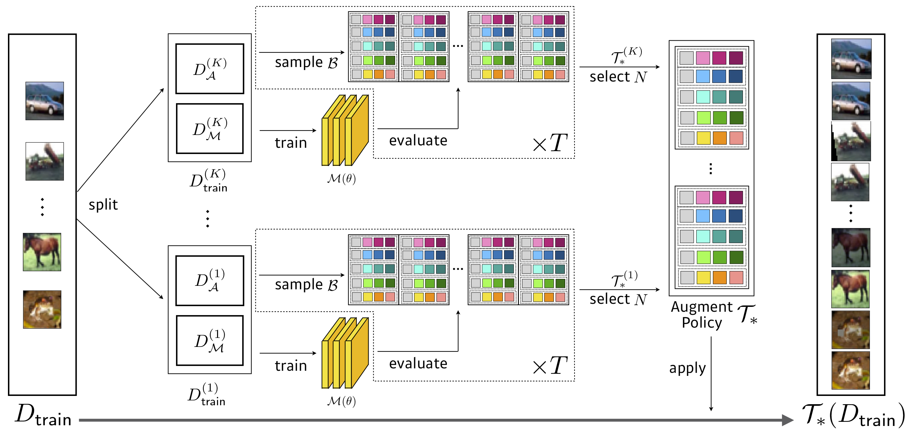
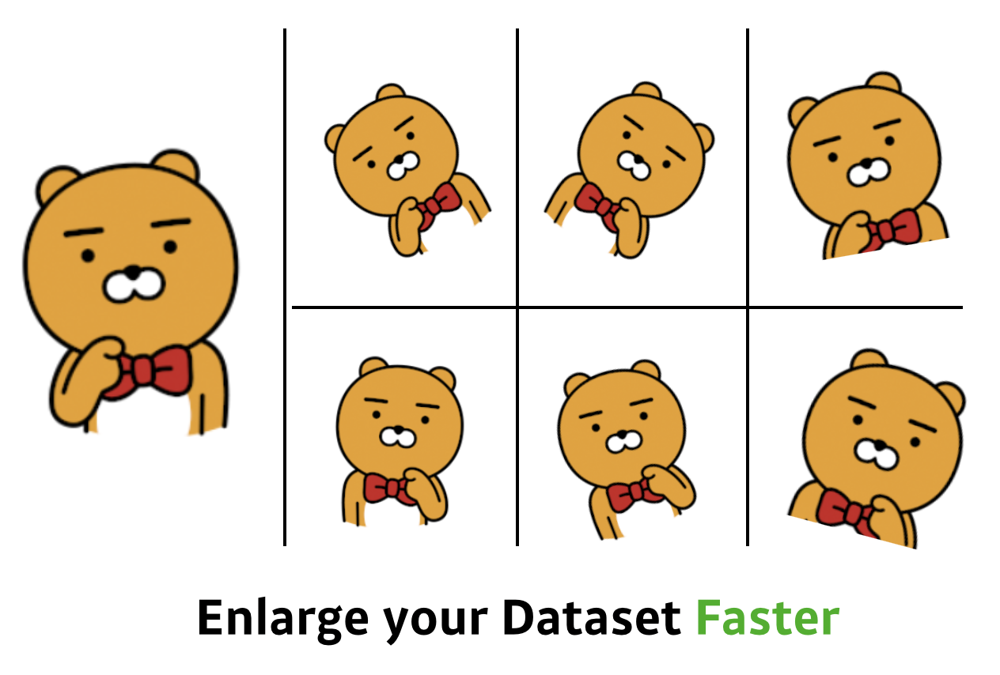

# Fast AutoAugment **(Accepted at NeurIPS 2019)**

Official [Fast AutoAugment](https://arxiv.org/abs/1905.00397) implementation in PyTorch.

- Fast AutoAugment learns augmentation policies using a more efficient search strategy based on density matching.
- Fast AutoAugment speeds up the search time by orders of magnitude while maintaining the comparable performances.


<!--  -->

{:class="center-block" height="70%"}

## Results

### CIFAR-10 / 100

Search : **3.5 GPU Hours (1428x faster than AutoAugment)**, WResNet-40x2 on Reduced CIFAR-10

| Model(CIFAR-10)         | Baseline   | Cutout     | AutoAugment | Fast AutoAugment<br/>(transfer/direct) |   |
|-------------------------|------------|------------|-------------|------------------|----|
| Wide-ResNet-40-2        | 5.3        | 4.1        | 3.7         | 3.6 / 3.7        | [Download](https://arena.kakaocdn.net/brainrepo/fast-autoaugment/cifar10_wresnet40x2_top1_3.52.pth) |
| Wide-ResNet-28-10       | 3.9        | 3.1        | 2.6         | 2.7 / 2.7        | [Download](https://arena.kakaocdn.net/brainrepo/fast-autoaugment/cifar10_wresnet28x10_top1.pth) |
| Shake-Shake(26 2x32d)   | 3.6        | 3.0        | 2.5         | 2.7 / 2.5        | [Download](https://arena.kakaocdn.net/brainrepo/fast-autoaugment/cifar10_shake26_2x32d_top1_2.68.pth) |
| Shake-Shake(26 2x96d)   | 2.9        | 2.6        | 2.0         | 2.0 / 2.0        | [Download](https://arena.kakaocdn.net/brainrepo/fast-autoaugment/cifar10_shake26_2x96d_top1_1.97.pth) |
| Shake-Shake(26 2x112d)  | 2.8        | 2.6        | 1.9         | 2.0 / 1.9        | [Download](https://arena.kakaocdn.net/brainrepo/fast-autoaugment/cifar10_shake26_2x112d_top1_2.04.pth) |
| PyramidNet+ShakeDrop    | 2.7        | 2.3        | 1.5         | 1.8 / 1.7        |

| Model(CIFAR-100)      | Baseline   | Cutout     | AutoAugment | Fast AutoAugment<br/>(transfer/direct) |    |
|-----------------------|------------|------------|-------------|------------------|----|
| Wide-ResNet-40-2      | 26.0       | 25.2       | 20.7        | 20.7 / 20.6      | [Download](https://arena.kakaocdn.net/brainrepo/fast-autoaugment/cifar100_wresnet40x2_top1_20.43.pth) |
| Wide-ResNet-28-10     | 18.8       | 28.4       | 17.1        | 17.3 / 17.3      | [Download](https://arena.kakaocdn.net/brainrepo/fast-autoaugment/cifar100_wresnet28x10_top1_17.17.pth) |
| Shake-Shake(26 2x96d) | 17.1       | 16.0       | 14.3        | 14.9 / 14.6      | [Download](https://arena.kakaocdn.net/brainrepo/fast-autoaugment/cifar100_shake26_2x96d_top1_15.15.pth) |
| PyramidNet+ShakeDrop  | 14.0       | 12.2       | 10.7        | 11.9 / 11.7      |

### ImageNet

Search : **450 GPU Hours (33x faster than AutoAugment)**, ResNet-50 on Reduced ImageNet

| Model      | Baseline   | AutoAugment | Fast AutoAugment<br/>(Top1/Top5) |    |
|------------|------------|-------------|------------------|----|
| ResNet-50  | 23.7 / 6.9 | 22.4 / 6.2  | **22.4 / 6.3**   | [Download](https://arena.kakaocdn.net/brainrepo/fast-autoaugment/imagenet_resnet50_top1_22.2.pth) |
| ResNet-200 | 21.5 / 5.8 | 20.0 / 5.0  | **19.4 / 4.7**   |

### SVHN Test

Search : **0.3413 GPU Hours**

|                                  | Baseline | AutoAug / Our | Fast AutoAugment  |
|----------------------------------|---------:|--------------:|--------:|
| Wide-Resnet28x10                 | 1.5      | 1.1           | 1.1     |


## Run

We conducted experiments under

- python 3.6.9
- pytorch 1.2.0, torchvision 0.4.0, cuda10

### Search a augmentation policy

Please read ray's document to construct a proper ray cluster : https://github.com/ray-project/ray, and run search.py with the master's redis address.

```
$ python search.py -c confs/wresnet40x2_cifar10_b512.yaml --dataroot ... --redis ...
```

### Train a model with found policies

You can train network architectures on CIFAR-10 / 100 and ImageNet with our searched policies.

- fa_reduced_cifar10 : reduced CIFAR-10(4k images), WResNet-40x2
- fa_reduced_imagenet : reduced ImageNet(50k images, 120 classes), ResNet-50

```
$ export PYTHONPATH=$PYTHONPATH:$PWD
$ python FastAutoAugment/train.py -c confs/wresnet40x2_cifar10_b512.yaml --aug fa_reduced_cifar10 --dataset cifar10
$ python FastAutoAugment/train.py -c confs/wresnet40x2_cifar10_b512.yaml --aug fa_reduced_cifar10 --dataset cifar100
$ python FastAutoAugment/train.py -c confs/wresnet28x10_cifar10_b512.yaml --aug fa_reduced_cifar10 --dataset cifar10
$ python FastAutoAugment/train.py -c confs/wresnet28x10_cifar10_b512.yaml --aug fa_reduced_cifar10 --dataset cifar100
...
$ python FastAutoAugment/train.py -c confs/resnet50_b512.yaml --aug fa_reduced_imagenet
$ python FastAutoAugment/train.py -c confs/resnet200_b512.yaml --aug fa_reduced_imagenet
```

By adding --only-eval and --save arguments, you can test trained models without training.

## Citation

If you use any part of this code in your research, please cite our [paper](https://arxiv.org/abs/1905.00397).

```
@inproceedings{lim2019fast,
  title={Fast AutoAugment},
  author={Lim, Sungbin and Kim, Ildoo and Kim, Taesup and Kim, Chiheon and Kim, Sungwoong},
  booktitle={Advances in Neural Information Processing Systems (NeurIPS)},
  year={2019}
}
```

## Contact for Issues
- Ildoo Kim, ildoo.kim@kakaobrain.com
- Sungbin Lim, sungbin.lim@kakaobrain.com


## References & Opensources

1. ResNet References
    - (ResNet) Deep Residual Learning for Image Recognition
      - Paper : https://arxiv.org/abs/1512.03385
    - (ResNet) Identity Mappings in Deep Residual Networks
      - Paper : https://arxiv.org/abs/1603.05027
    - Codes
      - https://github.com/osmr/imgclsmob/tree/master/pytorch/pytorchcv/models
2. (PyramidNet) Deep Pyramidal Residual Networks
    - Paper : https://arxiv.org/abs/1610.02915
    - Author's Code : https://github.com/dyhan0920/PyramidNet-PyTorch
3. (Wide-ResNet)
    - Code : https://github.com/meliketoy/wide-resnet.pytorch
4. (Shake-Shake)
    - Code : https://github.com/owruby/shake-shake_pytorch
5. ShakeDrop Regularization for Deep Residual Learning
    - Paper : https://arxiv.org/abs/1802.02375
    - Code : https://github.com/owruby/shake-drop_pytorch
6. (ARS-Aug) Learning data augmentation policies using augmented random search
    - Paper : https://arxiv.org/abs/1811.04768
    - Author's Code : https://github.com/gmy2013/ARS-Aug
7. AutoAugment
    - Code : https://github.com/tensorflow/models/tree/master/research/autoaugment
8. https://pytorch.org/docs/stable/torchvision/models.html
9. https://github.com/eladhoffer/convNet.pytorch/blob/master/preprocess.py
10. Ray : https://github.com/ray-project/ray
12. HyperOpt : https://github.com/hyperopt/hyperopt
